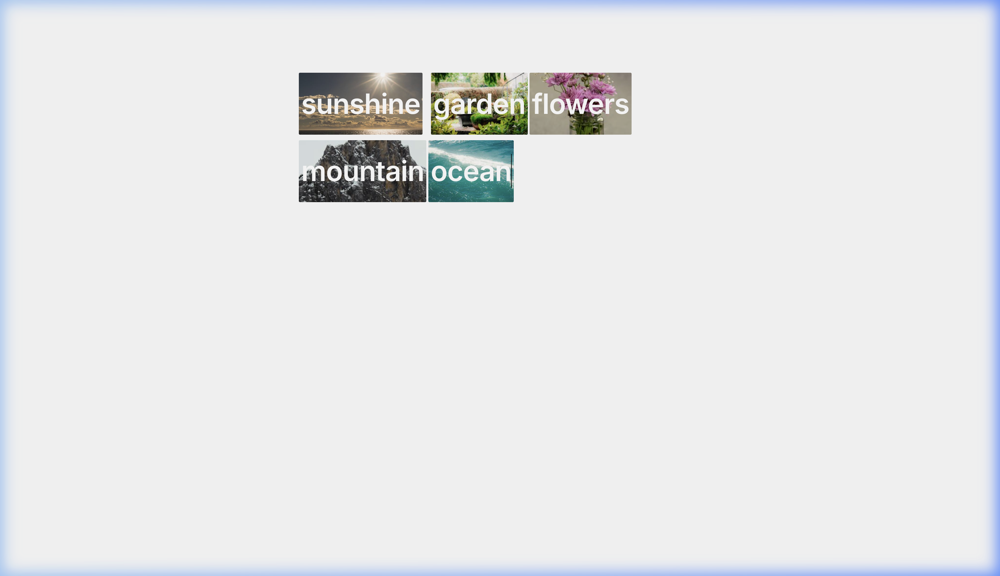

# Visual Text

A writing interface where images appear behind words as you type. Each concept word (nouns, verbs, adjectives) triggers a real-time image search via the [Pexels API](https://www.pexels.com/api/), creating a visual layer beneath the text.

## Demo



## Try It

**Live →** [alexpuliatti.github.io/visual-text](https://alexpuliatti.github.io/visual-text/)

## Run Locally

```bash
git clone https://github.com/alexpuliatti/visual-text.git
cd visual-text
npm install
```

Create a `.env` file with your [Pexels API key](https://www.pexels.com/api/new/):

```
VITE_PEXELS_API_KEY=your_api_key_here
```

```bash
npm run dev
```

## How It Works

1. **You type** into a hidden `<textarea>` — standard text input with a visible caret
2. **A visual layer** renders each word as an inline `<span>`, perfectly overlaid on top
3. **Concept words** (filtered via a stop-words list) trigger a debounced Pexels API search
4. **Images fade in** behind the word text using Framer Motion, sized to match the word bounds
5. **Text turns white** over images for contrast

## Built With

- [React](https://react.dev/) + [Vite](https://vite.dev/)
- [Framer Motion](https://motion.dev/) — image fade-in animations
- [Pexels API](https://www.pexels.com/api/) — image search

## License

MIT
